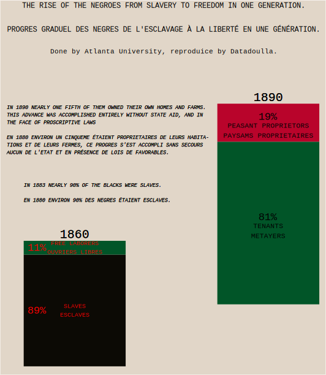

## [#DuBoisChallenge2024](https://github.com/ajstarks/dubois-data-portraits/tree/master/challenge/2024)

This repository is dedicated to my participation in 2024 `#DuBoisChallenge2024`.

------------------------------- 

## [Week 2](./challenge02)

> I realized that some folks, a few, even several, actually considered my brown skin a misfortune. Once or twice I became painfully aware that some human beings even thought it a crime. 
> -- <cite>[W.E.B. Du Bois](https://penntoday.upenn.edu/news/times-and-life-web-du-bois-penn)</cite>

See the original plate [here](challenge02/original-plate-12.jpg)

## [Week 3](./challenge03)

> Black youth start in life knowing that on all sides, his advance is made doubly difficult, if not wholly shut off, by his color.
> -- <cite>[W.E.B. Du Bois](https://penntoday.upenn.edu/news/times-and-life-web-du-bois-penn)</cite>

See the original plate [here](challenge03/original-plate-19.jpg)

## [Week 5](./challenge05)

En réponse à une lettre d’un étudiant noir nommé Roland Barton qui demandait en 1928 que l’on supprimât le mot « Negro » des colonnes de The Crisis en raison de son caractère insultant, Du Bois répondit :

> Comprenez ceci, Roland, et comprenez le bien même si cela doit transpercer votre âme : sous n’importe quel autre nom, un Nègre serait tout aussi noir et tout aussi blanc, tout aussi honteux de lui-même et tout autant couvert de honte par les autres qu’il l’est aujourd’hui. Ce n’est pas le nom qui compte, c’est la Chose.
> -- <cite>[W.E.B. Du Bois](https://www.cairn.info/revue-raisons-politiques-2006-1-page-97.htm#no50)</cite>

See the original plate [here](challenge05/original-plate-13.jpg)

## [Week 7](./challenge07)

> ...
> -- <cite>[W.E.B. Du Bois]()</cite>

See the original plate [here](challenge07/original-plate-47.jpg)

## [Week 8](./challenge08)

> ...
> -- <cite>[W.E.B. Du Bois]()</cite>

See the original plate [here](challenge08/original-plate-50.jpg)
